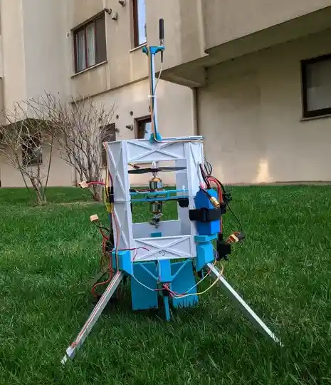

A small VTOL that climbs to 100 to 200 metres, hovers while it logs a handful of data readings, then flies itself back and lands.



---

## Why two motors instead of four

I used two brushless motors on a single vertical axis, one on top and one on the bottom, spinning in opposite directions.

The torque each rotor puts on the frame works out to

$$
\boldsymbol{\tau}_{\text{airframe}} = \boldsymbol{\tau}_{\text{top}} + \boldsymbol{\tau}_{\text{bottom}} = k_\tau\left(\omega_{\text{top}}^2 - \omega_{\text{bottom}}^2\right)\hat{z}
$$

where $k_\tau$ is the motor's torque coefficient and $\omega$ is each rotor's speed. Because the two rotors spin opposite ways, that difference naturally trends toward zero. Yaw becomes a matter of speeding up one motor and slowing the other, instead of needing a separate control surface just for that. It also keeps the frame narrow.

Fine trim and yaw correction come from four small PWM-actuated fins sitting in the airflow below the bottom rotor.

---

## Attitude and altitude control

Roll, pitch, yaw, and climb rate each get their own PID loop running at 400 Hz. Roll and pitch drive the fins, yaw drives the differential motor speed, and climb rate drives common-mode motor speed (both motors moving together). In continuous form, one axis looks like:

$$
u(t) = K_p\, e(t) + K_i \int_0^t e(\sigma)\, d\sigma + K_d \frac{de(t)}{dt}
$$

and on the actual flight controller it's discretised into something like this:

```c
// Single-axis PID, called at 400 Hz per axis
typedef struct {
    float kp, ki, kd;
    float integral;
    float prev_error;
    float integral_limit;
} pid_axis_t;

float pid_update(pid_axis_t *ax, float setpoint, float measured, float dt) {
    float error = setpoint - measured;

    ax->integral += error * dt;
    ax->integral = clampf(ax->integral, -ax->integral_limit, ax->integral_limit);

    float derivative = (error - ax->prev_error) / dt;
    ax->prev_error = error;

    return ax->kp * error + ax->ki * ax->integral + ax->kd * derivative;
}
```

Altitude uses two loops instead of one. The outer loop reads barometer and GPS altitude (blended with a complementary filter) and outputs a target climb rate. The inner loop tracks that climb rate by adjusting common-mode motor speed. I split it this way because a single loop mapping altitude error straight to thrust tends to either overshoot or crawl near the target. Splitting it lets the inner loop react fast while the outer loop just decides where it should be heading.

---

## Communication

A radio transmitter streams telemetry continuously to a ground station rather than waiting on requests, so a dropped packet just costs one sample instead of stalling the link. The base station app plots the profile live as it comes in and logs everything to a file for later.

---

## Airframe

The frame uses a cross-braced lattice of 3D-printed composite parts, chosen for stiffness rather than pure minimum weight, since a flexing frame shows up as noise in the IMU, especially noise that lines up with rotor RPM. Four splayed landing legs give it a wide, stable base for uneven ground.

---

Built for atmospheric research, environmental monitoring, and testing out stabilization ideas in the field, something I plan to redo in the future.
