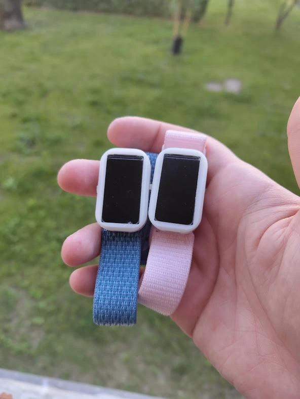

A tiny, deliberately single-purpose watch that does exactly one thing: shows your partner how you're feeling. No step counter, no heart rate, no weather.



I was tired of texting my partner a "❤️" and watching it sink into a notification stack between a grocery reminder and a LinkedIn email. So I built a watch. You pick an emoji, add an optional message of up to 20 characters, hit send, and it appears on their wrist a second or two later. They can't reply. There's no chat. The constraint is the whole point.

It turned into a full-stack embedded build: C++ firmware, a cross-platform Ionic React app, Supabase for auth and data, Firebase for server-side logic, and OneSignal for push. I did all of it alone, which was either ambitious or foolish depending on the week.

| Battery life | Display | Radio | Stack depth |
| ------------ | ------- | ----- | ----------- |
| ~72 h on a 70 mAh LiPo | 1.47" 172×320 ST7789V3 | BLE 5 (ESP32-C3) | 5 layers, end to end |

---

## How a feeling travels

Here's the full pipeline, written out so I can pretend it sounds simple:

```
[Partner A's phone] → Supabase DB → Firebase Function
  → OneSignal push → [Partner B's phone] → BLE → [Watch]
```

Partner A taps send, and that write lands in Supabase. A Firebase Cloud Function fires off the insert and asks OneSignal to push a notification to Partner B's phone. Partner B's phone asks "Display on watch?", and if the answer is yes, the app connects over BLE, writes the payload, and the watch renders it.

The watch never touches the internet. Ever. All cloud traffic routes through the phone. I'd love to call that a clever upfront decision, but it's really just what happens when you have a 70 mAh battery and no desire to implement TLS on a microcontroller.

:::note type=info title="Offline-only was the best constraint I imposed"
Keeping the watch off the network made the firmware dramatically simpler and the power draw dramatically lower. There's no certificate management, no Wi-Fi reconnection logic, and no MQTT broker. The phone does the hard work, and the watch just renders.
:::

---

## The hardware

The brain is a **Seeed Studio XIAO ESP32-C3**, chosen for an embarrassingly practical reason: it has a USB-serial chip and a LiPo charger built in. That removed two external ICs from a board that was already going to be cramped, and the chip speaks BLE 5 natively, which is all I needed.

The screen is a **1.47" IPS panel** driven by an ST7789V3 over SPI, with 262K colours and rounded corners that suit a wristband. I didn't do anything special to get those corners, that's just how the panel is cut. Power comes from a **70 mAh LiPo**, which sounds absurdly small because it is, and it's the only thing that physically fit.

| Component | Choice             | Why                                             |
| --------- | ------------------ | ----------------------------------------------- |
| MCU       | XIAO ESP32-C3      | Onboard USB-serial + LiPo charger saves two ICs |
| Display   | 1.47" ST7789V3 IPS | Rounded, SPI, fits the enclosure                |
| Battery   | 70 mAh LiPo        | Only thing that physically fit                  |
| Comms     | BLE (ESP32 native) | Low power, no infrastructure                    |

Wiring is nothing exotic: standard SPI to the display, one GPIO for the backlight, one for the button.

| Signal    | GPIO | Notes                          |
| --------- | ---- | ------------------------------ |
| Button    | D0   | Wake / sleep, `INPUT_PULLUP`   |
| Backlight | D1   | Must be held during deep sleep |
| SPI MOSI  | D10  | LCD data                       |
| SPI SCK   | D8   | LCD clock                      |
| SPI CS    | D7   | LCD chip select                |
| SPI DC    | D3   | Data / command select          |
| SPI RST   | D2   | Hardware reset                 |

---

## The firmware

The firmware has two jobs: handle BLE writes and draw things on the screen. Everything else is either off or asleep.

`setup()` kills Wi-Fi immediately, since the RF transceiver can pull around 200 mA when active and the watch has no use for it. It then registers the button as a deep-sleep wake source and hands off to the BLE and display initialisers.

```cpp
void setup() {
  Serial.begin(115200);

  // Release any GPIO hold state left over from before sleep
  gpio_hold_dis((gpio_num_t)GFX_BL);

  // Kill Wi-Fi completely: not just stopped, actually deinitialized
  esp_wifi_stop();
  esp_wifi_deinit();

  pinMode(GFX_BL, OUTPUT);
  pinMode(BUTTON_PIN, INPUT_PULLUP);

  // Button wakes the device from deep sleep when pulled low
  esp_deep_sleep_enable_gpio_wakeup(
    1 << BUTTON_PIN,
    ESP_GPIO_WAKEUP_GPIO_LOW
  );

  initGFX();
  initBLE();
}
```

Calling `esp_wifi_deinit()` rather than just `stop()` releases the transceiver from the power domain entirely. That's worth about 1 mA at idle, which matters a lot when the whole battery is 70 mAh.

### A very small BLE server

The watch advertises one GATT service with one read/write characteristic. The app connects, writes a payload, and disconnects. There are no persistent connections and no subscriptions. I kept the BLE surface area as small as I could, because every feature I didn't implement was a bug I didn't have to fix.

```cpp
void initBLE() {
  BLEDevice::init("Mootify");

  BLEServer  *pServer  = BLEDevice::createServer();
  BLEService *pService = pServer->createService(SERVICE_UUID);

  BLECharacteristic *pChar = pService->createCharacteristic(
    CHARACTERISTIC_UUID,
    BLECharacteristic::PROPERTY_READ |
    BLECharacteristic::PROPERTY_WRITE
  );

  pChar->setCallbacks(new MyCallbacks());
  pService->start();

  BLEAdvertising *pAdv = BLEDevice::getAdvertising();
  pAdv->addServiceUUID(SERVICE_UUID);
  pAdv->start();
}
```

### The world's tiniest protocol

The app sends `{emojiIndex}&{message}`, for example `4&You're amazing!`. I picked `&` as the delimiter because it can't appear in an emoji index and is unlikely to show up in a short, sincere message. The message cap of 20 characters keeps the whole payload small enough for a single quick write.

```cpp
class MyCallbacks : public BLECharacteristicCallbacks {
  void onWrite(BLECharacteristic *pCharacteristic) {
    String value = pCharacteristic->getValue();

    if (value.length() > 0) {
      char receivedText[21] = { 0 };
      memcpy(receivedText, value.c_str(), value.length());
      receivedText[value.length()] = '\0';

      // First token: emoji array index
      char *splitText = strtok(receivedText, "&");
      int   number    = atoi(splitText);
      ind             = number;

      // Second token: message string
      splitText = strtok(NULL, "&");
      if (splitText != NULL) {
        strcpy(recText, splitText);
      }
    }
  }
};
```

`ind` is a global that selects the image from a flash array, and `recText` is the display buffer. Both get picked up by the render loop on its next tick.

### Pixels straight from flash

Emotion images are stored as raw `uint16_t` arrays, each one 64×64 in RGB565 and about 8 KB. They're compiled directly into the binary, so there's no SD card, no SPIFFS, and no filesystem of any kind. It isn't elegant, but it's fast and it works.

```cpp
if (ind >= 0 && !isDrawn) {
  isDrawn = true;

  gfx->fillScreen(RGB565_BLACK);
  gfx->setRotation(1);

  // Blit the emotion image directly from flash
  gfx->draw16bitRGBBitmap(128, IMG_Y,
    images[ind], IMG_WIDTH, IMG_HEIGHT);

  // Overlay the text below
  gfx->setCursor(10, 172);
  gfx->setTextColor(RGB565_WHITE);
  gfx->setTextSize(2, 3, 0);
  gfx->setRotation(2);
  gfx->println(String(recText));
}
```

The `isDrawn` flag stops the loop from redrawing every tick, and it resets when the device sleeps so each wake starts clean.

---

## Where the milliamps went

This is where I spent most of my debugging time. A battery's runtime is just capacity divided by average current:

$$
t_{\text{runtime}} = \frac{C_{\text{battery}}}{I_{\text{avg}}}
$$

With $C = 70\,\text{mAh}$ and a measured runtime of about 72 hours, the watch averages roughly 1 mA. That only works if deep sleep is genuinely deep.

```cpp
void goToSleep() {
  ind     = -1;
  isDrawn = false;

  gfx->fillScreen(RGB565_BLACK);
  digitalWrite(GFX_BL, LOW);

  // Hold the backlight pin low during deep sleep
  // Without this it floats and the panel draws current anyway
  gpio_hold_en((gpio_num_t)GFX_BL);

  esp_deep_sleep_start();
}
```

Sleep triggers after 30 seconds of inactivity or a 3-second button hold. The `gpio_hold_en` call is not optional. It locks the backlight pin's state so it can't float high and quietly power the display. I learned this when my first prototype measured **4 mA** in "sleep" instead of the expected **22 µA**, a gap of roughly 180×.

:::note type=purple title="Debugging tip: hunt the floating GPIO"
If an ESP32 project has a mysteriously high deep-sleep current, check every output GPIO you haven't explicitly held. A floating pin on an LCD backlight or LED driver is the most common culprit, and `gpio_hold_en` is the fix.
:::

---

## The mobile app


The app is built with **Ionic React and Capacitor**, because I wanted one codebase for iOS and Android and I already knew React. Styling is TailwindCSS. It's not glamorous, but it shipped.

**Auth and friends.** Supabase handles authentication. On first login the app creates a profile with a short, human-readable ID, the kind you can read out over a voice call. Partners add each other by entering that ID, and the friendship record is stored bidirectionally, so there's no "accept" step. I cut it because the use case is two people who already know each other.

**Sending is the whole product.** Pick a friend, swipe through the emoji carousel, optionally type a message (20 characters, hard enforced), and tap **Send**. Two things then happen in parallel: a Supabase insert creates the message record, and a Firebase Cloud Function triggered by that insert looks up the recipient's device token and fires the OneSignal push.

**Receiving** is a short hop. The push opens the pending message, the app shows **"Display on Watch?"**, and on confirm the Capacitor BLE plugin scans for the watch, connects, writes the payload, and disconnects.

```typescript
import { BleClient } from "@capacitor-community/bluetooth-le";

async function sendToWatch(emojiIndex: number, message: string) {
  await BleClient.initialize();

  const device = await BleClient.requestDevice({
    services: [SERVICE_UUID],
  });

  await BleClient.connect(device.deviceId);

  const payload = `${emojiIndex}&${message}`;
  const encoded = new TextEncoder().encode(payload);

  await BleClient.write(device.deviceId, SERVICE_UUID, CHARACTERISTIC_UUID, dataViewFromBuffer(encoded));

  await BleClient.disconnect(device.deviceId);
}
```

### Why two backends

```
Supabase
  ├── auth.users          — identity
  ├── public.profiles     — display name, short ID, device token
  ├── public.friends      — bidirectional friendship records
  └── public.messages     — emotion history

Firebase
  └── Cloud Functions
        └── onMessageInsert
              → reads recipient token from profiles
              → calls OneSignal REST API

OneSignal
  └── Delivers to iOS APNs + Android FCM
```

I split the work rather than pick one platform for everything. Supabase is better at structured data and row-level auth, while Firebase Functions give a clean trigger point with no always-on infrastructure. Neither does everything well, but together they cover it.

---

## How it actually went

From tapping Send to the image appearing on screen, the local part of the trip took about **400 ms**. Roughly 250 ms of that is BLE scan and connection setup, and the write and render take about 40 ms. The cloud leg (Supabase, Firebase, OneSignal, then the phone) adds another 1 to 3 seconds depending on the network, which feels right for a notification. It's not a chat app.

| Metric | Result |
| ------ | ------ |
| Battery life | 68–74 h |
| Deep-sleep current | ~22 µA |
| Local latency (scan → render) | ~400 ms |
| Cloud latency | 1–3 s |

The 22 µA figure is higher than the ESP32-C3's rated 5 µA floor because the display driver and LDO add their own quiescent draw on top. That's simply where this hardware configuration ends up.

:::note type=warning title="Android caches BLE device IDs, and then it doesn't"
The part that punished me most was Android's BLE device ID caching. The Capacitor plugin returns an ID that Android derives from a cached advertisement. Clear the Bluetooth cache, which Android does periodically and users do when troubleshooting, and the ID changes, so the app can no longer find the watch it paired with yesterday. The fix is a fallback scan by service UUID that adds about 800 ms in the worst case. I should have built that first and skipped the happy path entirely.
:::

---

## What comes next

The prototype lives on a XIAO breakout board, which is fine for proving the concept and embarrassing to ship. The next step is a custom PCB in EasyEDA with:

- An ESP32-C6 or a RISC-V variant for better BLE 5 support
- A proper LDO rail with real decoupling capacitors, not breadboard assumptions
- USB-C with an MX30 connector
- A 200 mAh LiPo plus a MAX17048 fuel gauge, so battery percentage is real
- A DRV2605L haptic driver for vibration feedback
- Optionally, a higher-resolution panel if the enclosure allows

On the app side, the wishlist is a bigger emotion library, chat history, haptic patterns tied to each feeling, a clock mode for when no message is pending, and acknowledgement replies (a button press on the watch that sends a "❤️ received" back).

There are plenty of smartwatches trying to replace your phone on your wrist. Mootify does the opposite: it does one thing, and does it so narrowly that it can't be used for anything else, which means it gets used for exactly what it was built for. That constraint has real product value.

The long-term play is a product family of emotion rings, haptic keyrings, and ambient mood lamps, all on the same Supabase and OneSignal backend and all doing one emotional thing and nothing else. Whether that's a business or just a series of increasingly elaborate gifts for my partner remains to be seen.